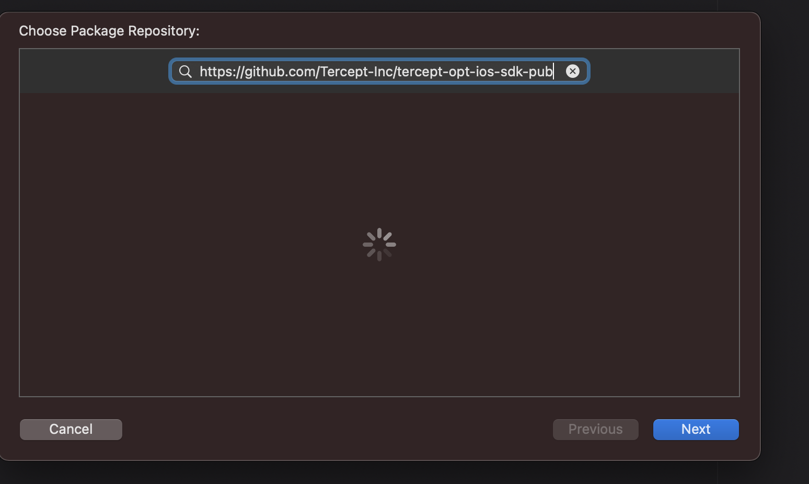
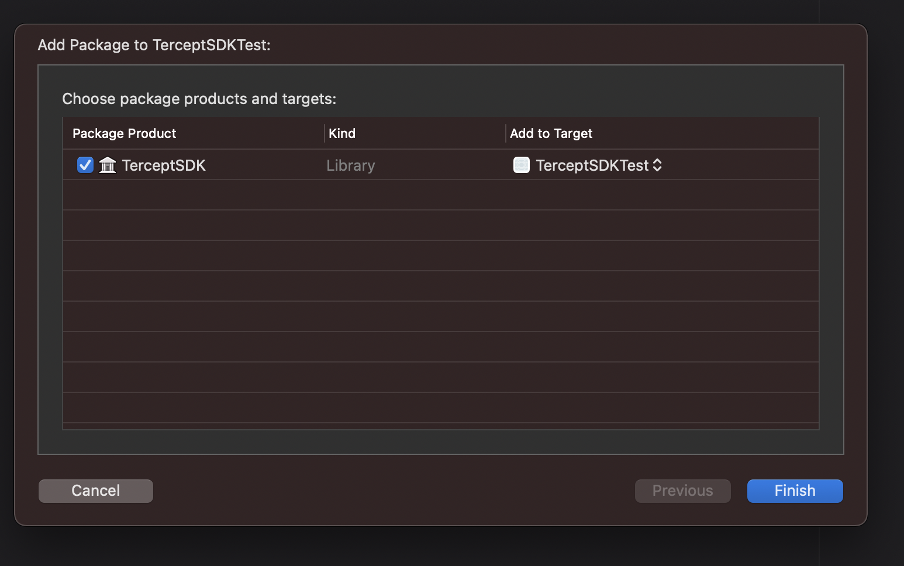

## Tercept iOS SDK for Tercept Analytics & Optimization
---

Steps to add 'TerceptSDK' Swift Package to Xcode project.

    a.  Open the Xcode project.

    b.  Go to File \> Swift Packages \> Add Package Dependency.

    c.  Type <https://github.com/Tercept-Inc/tercept-opt-ios-sdk-pub>
        into the search field and tap next.

> 

d.  Now, choose the version 4.0.6 to fetch the repository.

e.  Select the target where you will add the package.

> 

&nbsp;
## Tercept SDK Usage and Functions
----
- ## **Initialize the SDK by instantiating TerceptOptimization**
  One can choose one of the following ways
```
  import TerceptSDK
  let terceptOpt = TerceptOptimization(<networkCode>, <idfa>, <idfv>)
```
or
```
  import TerceptSDK
  let terceptOpt = TerceptOptimization(<networkCode>, <idfa>, <idfv>, initCustomParams)
```
or
```
  import TerceptSDK
  let terceptOpt = TerceptOptimization(<networkCode>, useIdfa: true | false)
```
or
```
  import TerceptSDK
  let terceptOpt = TerceptOptimization(<networkCode>, useIdfa: true | false, initCustomParams)
```

- `networkCode` -> DFP network code
- `idfa` -> Identifier for advertisers
- `idfv` -> Identifier for vendor
- `useIdfa` -> whether to use idfa or not (True or False)
- `initCustomParams` -> type [String: String], Here we should send any parameters which might help tercept do a better targeting. e.g web_url, age or gender or any other parameter

If you work with different networkCodes in the same app then one has
to do initialization for all the different networkCodes

For example:

```
    let terceptOpt1 = TerceptOptimization(networkCode1, IDFA, IDFV)
    let terceptOpt2 = TerceptOptimization(networkCode2, IDFA, IDFV)
    .
    .
    .
```
`All the methods described below need to be called for each
instantiation of the TerceptOptimization class.`

---
- ## **For fetching key values for adunits from tercept server**
  One can choose one of the following ways
```
    terceptOpt.fetch(adunits);
```
or

```
    terceptOpt.fetch(adunits, dynamicCustomParams)
```
This function initiates an asynchronous HTTPS GET request which obtains ad-unit specific configuration

  - `adunits`: [String] -> List of strings representing the list of unique ad-unit names.
  - `dynamicCustomParams`: [String: String] -> customParams for each fetch(which is unique to each fetch request)

> Ideally, we should send in all the ad units in the app at once 

---


- ## **For getting key values for building the ad request**
  Before building each ad request, get custom targeting keys

    ```
        let keys = terceptOpt.getCustomTargetingKeys(adunit)
    ```
    - `keys` : [String: String] -> containing custom targeting key names and values
    - `adunit` : String -> A string representing the unique name of the adunit 

    &nbsp;
    And then iterate over the keys map and add custom targeting key
    values.

-----
- ## **For Logging gam events data**
  Listen to the following ad events:   
    _onAdClicked, onAdClosed, onAdFailedToLoad, onAdImpression, onAdLeftApplication, onAdLoaded, onAdOpened_

  And for IMA ads, there are some additional events:  
    _onFirstQuartile, onMidpoint, onThirdQuartile, onStarted, onSkipped_

  There is an enum class called `GAMEVENTS` which exposes all these events to the client while logging the events to Tercept.
 
  In the handlers for each of those events:
```
    terceptOpt.logEvent(adunit, eventName);
```
`adunit` : [String] -> A string representing the unique name of the adunit.

`eventName`: `GAMEVENTS` -> An enum field representing the unique name of the event from the following list of event names only: 

    onAdClicked, onAdClosed, onAdFailedToLoad, onAdImpression, onAdLeftApplication, onAdLoaded, onAdOpened, onFirstQuartile, onMidPoint, onThirdQuartile, onStarted, onSkipped

  Ideally, all the events must be logged. Tercept’s SDK will decide which events to actually capture to do advertisement optimizations.

  This function does not return anything.

  It can be used in conjunction with custom parameters as part of it to send custom parameters for the logging events.

  We can also pass custom event parameters to each event getting logged using this flavour of log event.

```
    terceptOpt.logEvent(adunit, eventName, customEventParams);
```  
> custom event parameters that will be attributed to the event like page URL,
> category, price etc.

----
- ## **To check what events are logged currently - FOR DEBUG on client side**
  We can check the events which have been currently logged by tercept to be sent to tercept’s server. This method is mostly for debugging purposes.

```
    terceptOpt.getEventsData()
```
  Returns a String of all the events logged to be sent to tercept.   


----
- ## **To send the logged events to tercept server**
  At the end of each user session:

```
    terceptOpt.sendEventsData();
```  


----
- ## **To set custom parameters explicitly**
  Additionally, if custom parameters cannot be sent in UI context, we can set them explicitly as well. This will be sent to the tercept server whenever events data is sent as part of `sendEventsData()`.

```
    terceptOpt.setCustomParameters(params);
```

  `Params` => list of [String: String] key values to be sent as custom parameters for tercept. Ideally, the instantiation should be preferred over this to maintain the sync of ad units and custom parameters.

